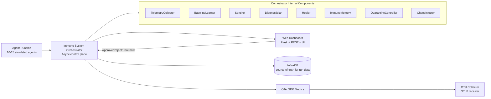
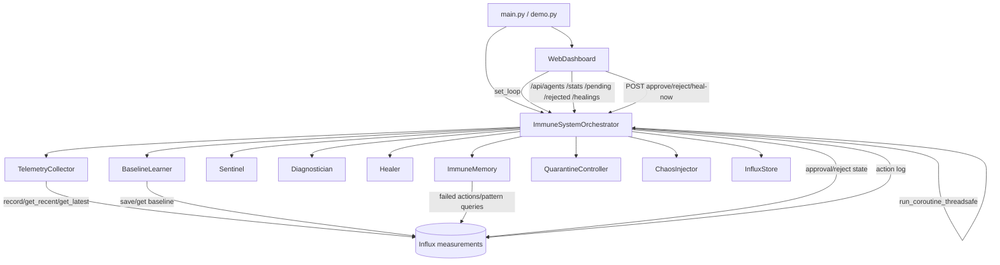
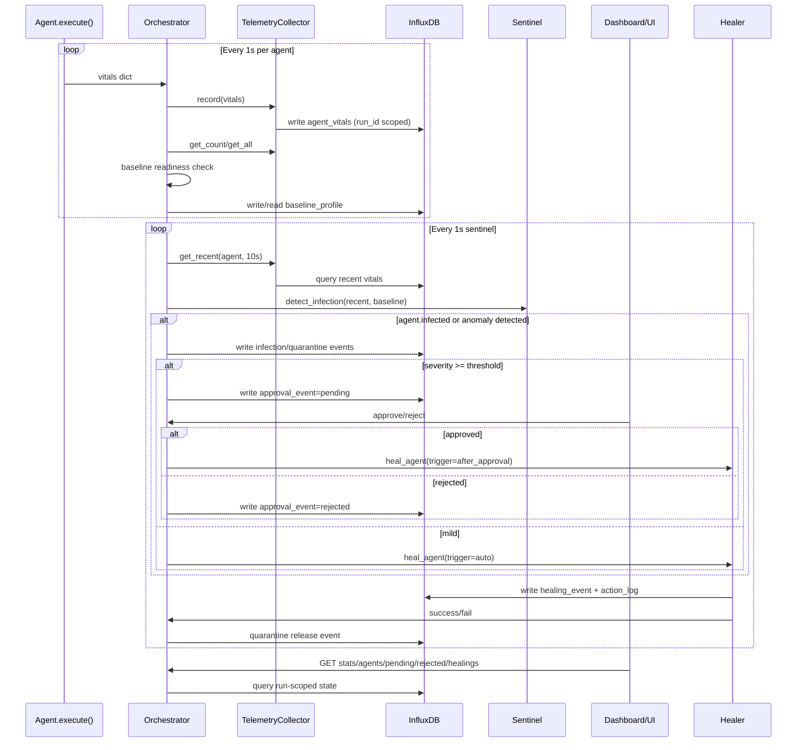

# AI Agent Immune System — Documentation (Single Reference)

This document is the **single reference** for the AI Agent Immune System: architecture, deployment, server API, healing and deviation, internal design (HLD/LLD), and operations. Keep this doc as the source of truth; update it when anything changes.

---

## 1. Executive Summary

| Layer | Role | Components |
|-------|------|-------------|
| **Client** | Apps, AI agents, and **immune system** | AI agents, full immune system (orchestrator, sentinel, healer, dashboard), **ApiStore** (calls server REST API; no direct DB) |
| **Server** | API + persistence | **Server app** (REST API only) + **InfluxDB**; no immune-system logic |
| **Optional** | Visibility | AppDynamics Controller for agent OTEL and/or immune-system events |

- **Self-healing:** When **severity** (0–10) is **below** `SEVERITY_REQUIRING_APPROVAL` (default 7.0), the system **auto-heals**. Above → **human-in-the-loop** (pending approval).
- **Deviation** is calculated in **one place:** **Sentinel** (`detection.py`), in `detect_infection(recent_vitals, baseline)`. Older metric data in InfluxDB is used to build the **baseline** and to supply **recent** vitals for that comparison.

**Alternative deployment:** Server-side — immune system as separate services (telemetry, baseline, sentinel, healer) on Kubernetes/OpenShift with a central DB. This doc focuses on the **recommended** client-deployed model.

---

## 2. Architecture (Client-Deployed)

### 2.1 Topology overview

```
┌─────────────────────────────────────────────────────────────────────────────────────────┐
│  CLIENT SIDE (Customer environment)                                                       │
│                                                                                          │
│  ┌──────────────────────────────────────────────────────────────────────────────────┐   │
│  │ AI Agents                                                                         │   │
│  │ • Run tasks, emit vitals (latency, tokens, tool_calls, retries, success)          │   │
│  └──────────────────────────────────────────────────────────────────────────────────┘   │
│                                          │                                               │
│                                          ▼                                               │
│  ┌──────────────────────────────────────────────────────────────────────────────────┐   │
│  │ AI Agent Immune System (same process or same host/cluster)                         │   │
│  │ • TelemetryCollector • BaselineLearner • Sentinel • Diagnostician • Healer        │   │
│  │ • QuarantineController • ImmuneMemory • Orchestrator • Web Dashboard              │   │
│  │ • Store = ApiStore → calls SERVER REST API only (no direct InfluxDB)               │   │
│  └──────────────────────────────────────────────────────────────────────────────────┘   │
│                                          │                                               │
│                              HTTPS → REST API (all DB operations)                       │
└─────────────────────────────────────────────────────────────────────────────────────────┘
                                          │
                                          ▼
┌─────────────────────────────────────────────────────────────────────────────────────────┐
│  SERVER SIDE (Your backend)                                                               │
│                                                                                          │
│  ┌──────────────────────────────────────────────────────────────────────────────────┐   │
│  │ Server App (API layer)                                                             │   │
│  │ • REST API that mirrors InfluxStore operations                                     │   │
│  │ • Auth (e.g. API key or OAuth per client/tenant)                                   │   │
│  │ • Validates and forwards requests to InfluxDB                                     │   │
│  └──────────────────────────────────────────────────────────────────────────────────┘   │
│                                          │                                               │
│                                          ▼                                               │
│  ┌──────────────────────────────────────────────────────────────────────────────────┐   │
│  │ InfluxDB                                                                          │   │
│  │ • agent_vitals, baseline_profile, infection_event, quarantine_event,              │   │
│  │   approval_event, healing_event, action_log (same schema as InfluxStore)          │   │
│  └──────────────────────────────────────────────────────────────────────────────────┘   │
└─────────────────────────────────────────────────────────────────────────────────────────┘
```

- **Client:** AI agents + full immune system; store is **ApiStore** (HTTP to server only). No InfluxDB client on the client.
- **Server:** One application exposing the REST API (§6); it reads/writes InfluxDB (same schema as `InfluxStore`). No immune-system business logic (no sentinel, healer, or dashboard).
- **Backend:** InfluxDB only; all access via server API.

### 2.2 Client-side components (what runs at the customer)

| Component | Responsibility |
|-----------|-----------------|
| **AI agents** | Execute tasks; produce vitals (latency, token_count, tool_calls, retries, success). Stable `agent_id` (and optional agent_type, model, mcp_servers). |
| **Orchestrator** | Runs agent loops, sentinel loop, baseline learning; coordinates all components; uses **store** for persistence. |
| **TelemetryCollector** | Records vitals via `store.write_agent_vitals()`; reads recent vitals via `store.get_recent_agent_vitals()`, etc. |
| **BaselineLearner** | Reads vitals from store; computes per-agent baseline (mean, stddev); writes via `store.write_baseline_profile()`; reads via `store.get_baseline_profile()`. |
| **Sentinel** | **Deviation calculated here.** Compares recent vitals to baseline in `detect_infection(recent, baseline)`; emits InfectionReport (severity, anomalies). Uses store only for inputs (recent/baseline come from store). |
| **Diagnostician** | Maps anomaly patterns to diagnosis types (prompt_drift, infinite_loop, tool_instability, etc.). |
| **Healer** | Applies policy ladder + immune memory; records outcomes via store; triggers quarantine release. |
| **QuarantineController** | In-memory set of quarantined agent IDs; approval workflow state (pending/rejected) read/written via store. |
| **ImmuneMemory** | Failed actions and pattern summary via store. |
| **Web Dashboard** | Serves UI; reads state from orchestrator (which reads from store); POST approve/reject/heal-now. |
| **Store** | **ApiStore** when `SERVER_API_BASE_URL` is set: same interface as `InfluxStore`, but every call is HTTP to the server REST API. No direct InfluxDB. |

Entry point: `main.py` or `demo.py` with `SERVER_API_BASE_URL` (and optional `SERVER_API_KEY`, `SERVER_RUN_ID`) → orchestrator gets ApiStore; otherwise `INFLUXDB_*` → InfluxStore, or in-memory.

### 2.3 Server-side (API layer + InfluxDB)

- **Server app:** Exposes REST endpoints (§6); authenticates requests (e.g. API key, `X-Run-Id`); for each request runs the corresponding InfluxDB read/write (same logic as `InfluxStore`). No detection, healing, or baseline logic.
- **InfluxDB:** Same schema as current `InfluxStore`: measurements and fields for agent_vitals, baseline_profile, infection_event, quarantine_event, approval_event, healing_event, action_log; tag `run_id` for multi-tenant/run isolation.

### 2.4 Data flow (client-deployed)

1. **Vitals:** Each agent run → TelemetryCollector.record(vitals) → ApiStore → `POST /api/v1/vitals` → server writes to InfluxDB.
2. **Baseline:** Orchestrator (agent loop) gathers vitals via store; when enough samples, BaselineLearner.learn_baseline() → store.write_baseline_profile() → server POST → InfluxDB.
3. **Detection:** Sentinel loop: for each agent, get recent vitals (store GET → server → InfluxDB) and baseline (store GET → server → InfluxDB); call **Sentinel.detect_infection(recent, baseline)** → deviation and severity computed here; if infection, quarantine and either add to pending (severity ≥ threshold) or schedule heal_agent (severity < threshold).
4. **Approval / healing:** Dashboard reads pending/rejected and healing log via orchestrator (store GETs). User Approve/Reject/Heal-now → orchestrator updates store (POST) → server → InfluxDB. Healer runs on client and writes healing events via store.

### 2.5 Component-to-file mapping (codebase)

| Component | File | Notes |
|-----------|------|--------|
| Entry point | `main.py`, `demo.py` | Store selection (ApiStore vs InfluxStore vs in-memory), orchestrator + dashboard. |
| Orchestrator | `orchestrator.py` | Agent loop, sentinel loop, approval/heal-now, store usage. |
| Agents | `agents.py` | BaseAgent, AgentState, vitals emission, infection simulation. |
| Telemetry | `telemetry.py` | TelemetryCollector; record, get_recent, get_all, get_latest. |
| Baseline | `baseline.py` | BaselineLearner, BaselineProfile; learn_baseline, get_baseline. |
| Sentinel | `detection.py` | **Deviation and severity** in detect_infection(recent_vitals, baseline). |
| Diagnosis | `diagnosis.py` | Diagnostician; anomaly pattern → diagnosis type. |
| Healing | `healing.py` | Healer, HEALING_POLICIES, healing actions. |
| Memory | `memory.py` | ImmuneMemory; failed actions, pattern summary. |
| Quarantine | `quarantine.py` | QuarantineController; quarantine/release set. |
| Dashboard | `web_dashboard.py` | Flask REST + UI; approve/reject/heal-now. |
| Store (direct DB) | `influx_store.py` | InfluxStore when using InfluxDB directly. |
| Store (API) | `api_store.py` | ApiStore when using server REST API. |

---

## 3. Internal Design (HLD / LLD / Data Flow)

The system is an async control plane: persistence can be **InfluxDB-backed** (run-scoped via `run_id`) or **server API–backed** (ApiStore when `SERVER_API_BASE_URL` is set).

### 3.1 HLD (High-Level Design)



### 3.2 LLD (Low-Level Design)



*Note: Store may be InfluxStore or ApiStore; when ApiStore, all DB operations go via HTTP to the server.*

### 3.3 Data flow (sequence)



### 3.4 Component mapping (file-level)

- `main.py` — App entrypoint, OTel configuration, store wiring (InfluxStore/ApiStore/in-memory), run duration control.
- `demo.py` — Demo entrypoint, dashboard startup with event loop reference, configurable duration.
- `orchestrator.py` — Core event loops: agent execution, sentinel detection, healing, approval/rejection workflow.
- `agents.py` — Simulated agents and infection modes; emits vitals each execution.
- `telemetry.py` — Telemetry abstraction and OTel metric instruments.
- `baseline.py` — Baseline profile learning and retrieval.
- `detection.py` — Statistical anomaly detection and severity scoring (deviation calculated here).
- `diagnosis.py` — Rule-based diagnosis from anomaly patterns.
- `healing.py` — Healing policies and action execution/validation.
- `memory.py` — Immune memory (failed actions/pattern summaries), backed by store queries.
- `web_dashboard.py` — REST API + UI rendering; user actions for approval/rejection/heal-now.
- `influx_store.py` — InfluxDB persistence/query layer (used when `INFLUXDB_*` is set).
- `api_store.py` — Server API–backed store: same interface as InfluxStore, calls remote REST API (used when `SERVER_API_BASE_URL` is set). See §6 for API contract.
- `observability/docker-compose.yml` — Local InfluxDB and OTel Collector stack.
- `observability/otel-collector-config.yaml` — OTLP receiver + debug exporter pipeline.

---

## 4. Healing and Deviation (Single Place to Update)

### 4.1 Where deviation is calculated

**Only in:** `detection.py` → **`Sentinel.detect_infection(recent_vitals, baseline)`**

- **Inputs:** `recent_vitals` (e.g. last 10s from store/InfluxDB), `baseline` (mean/stddev per metric from store/InfluxDB). Baseline is learned from **older metric data** in InfluxDB.
- **Logic:** Averages of recent latency, tokens, tools; per-metric deviation = |avg − baseline_mean| / baseline_stddev; anomaly if deviation > `threshold_stddev` (default 2.5); severity = min(10, 2 + max_dev * 0.45).
- **Output:** `InfectionReport` (severity 0–10, anomalies, deviations).

Orchestrator gets recent vitals and baseline from the store (InfluxDB or API), calls `sentinel.detect_infection(recent, baseline)` → deviation and severity are computed there.

### 4.2 Self-heal vs human-in-the-loop

| Severity | Behavior |
|----------|----------|
| **< SEVERITY_REQUIRING_APPROVAL** (default **7.0**) | **Self-healing:** Orchestrator schedules `heal_agent()`; healer runs policy ladder + immune memory. |
| **≥ 7.0** | **HITL:** Quarantine + add to pending approvals; healing only after Approve (or Heal now for rejected). |

- **Config:** `orchestrator.py`: `SEVERITY_REQUIRING_APPROVAL = 7.0`. Detection sensitivity: `Sentinel(threshold_stddev=2.5)` in `detection.py`.

### 4.3 Agent state and healing actions

- **reset_memory** → `agent.state.reset_memory()`  
- **rollback_prompt** → `agent.state.rollback_prompt()`  
- **reduce_autonomy** → `agent.state.reduce_autonomy()`  
- **clone_agent** → platform-specific.  
Status: `HEALTHY`, `INFECTED`, `QUARANTINED`; after successful healing, release from quarantine.

---

## 5. Client Configuration

### 5.1 Store selection (main.py / demo.py)

1. If **`SERVER_API_BASE_URL`** set → **ApiStore** (server API).  
2. Else if **`INFLUXDB_*`** set → **InfluxStore** (direct InfluxDB).  
3. Else → in-memory (no store).

### 5.2 Environment variables (client)

| Variable | Purpose |
|----------|---------|
| `SERVER_API_BASE_URL` | Base URL of server app. When set, use ApiStore. |
| `SERVER_API_KEY` | Optional; header `Authorization: Bearer <key>` or `X-API-Key: <key>`. |
| `SERVER_RUN_ID` | Optional; sent as `X-Run-Id`. |
| `INFLUXDB_URL`, `INFLUXDB_TOKEN`, `INFLUXDB_ORG`, `INFLUXDB_BUCKET` | Direct InfluxDB when server API not set. |

---

## 6. Server REST API Contract

Run context via header `X-Run-Id` or query `run_id`. Server maps each endpoint to InfluxDB (same schema as `InfluxStore`).

### 6.1 Telemetry

| Method | Path | Request | Response |
|--------|------|---------|----------|
| POST | `/api/v1/vitals` | JSON: agent_id, agent_type?, latency_ms, token_count, tool_calls, retries, success, timestamp? | 204 |
| GET | `/api/v1/vitals/recent` | Query: agent_id, window_seconds | 200 JSON array |
| GET | `/api/v1/vitals/all` | Query: agent_id | 200 JSON array |
| GET | `/api/v1/vitals/latest` | Query: agent_id | 200 object or 404 |
| GET | `/api/v1/vitals/execution-count` | Query: agent_id | 200 `{ "count": number }` |
| GET | `/api/v1/vitals/total-executions` | - | 200 `{ "total": number }` |

### 6.2 Baselines

| Method | Path | Request | Response |
|--------|------|---------|----------|
| POST | `/api/v1/baselines` | JSON: baseline profile (agent_id, latency_mean, latency_stddev, ...) | 204 |
| GET | `/api/v1/baselines/{agent_id}` | - | 200 or 404 |
| GET | `/api/v1/baselines/count` | - | 200 `{ "count": number }` |

### 6.3 Events

| Method | Path | Request | Response |
|--------|------|---------|----------|
| POST | `/api/v1/events/infection` | JSON: agent_id, severity, anomalies[], deviations, diagnosis_type | 204 |
| POST | `/api/v1/events/quarantine` | JSON: agent_id, action, duration_s? | 204 |

### 6.4 Approvals

| Method | Path | Request | Response |
|--------|------|---------|----------|
| POST | `/api/v1/approvals` | JSON: agent_id, decision, severity?, anomalies?, diagnosis_type?, reasoning?, infection_payload? | 204 |
| GET | `/api/v1/approvals/latest` | Query: optional agent_id | 200 by_agent or single |
| GET | `/api/v1/approvals/pending` | - | 200 array |
| GET | `/api/v1/approvals/rejected` | - | 200 array |

### 6.5 Healing

| Method | Path | Request | Response |
|--------|------|---------|----------|
| POST | `/api/v1/healing/events` | JSON: agent_id, diagnosis_type, healing_action, success, validation_passed, trigger?, message? | 204 |
| GET | `/api/v1/healing/failed-actions` | Query: agent_id, diagnosis_type | 200 `{ "actions": string[] }` |
| GET | `/api/v1/healing/total` | - | 200 `{ "total": number }` |
| GET | `/api/v1/healing/success-rate` | - | 200 `{ "rate": number }` |
| GET | `/api/v1/healing/pattern-summary` | - | 200 object |

### 6.6 Action log

| Method | Path | Request | Response |
|--------|------|---------|----------|
| POST | `/api/v1/action-log` | JSON: action_type, agent_id, payload | 204 |
| GET | `/api/v1/action-log/recent` | Query: limit? (default 50) | 200 array |

### 6.7 Health

| Method | Path | Response |
|--------|------|----------|
| GET | `/api/v1/health` | 200 if server and InfluxDB reachable |
| POST | `/api/v1/run` | Optional: return `{ "run_id": "..." }` |

---

## 7. Backend: InfluxDB Schema

Same as `InfluxStore`: measurements **agent_vitals**, **baseline_profile**, **infection_event**, **quarantine_event**, **approval_event**, **healing_event**, **action_log**; tag **run_id** for isolation. Server app is the only writer/reader when using client-deployed model; client uses API only.

---

## 8. Optional: AppDynamics

- **Client** (or server) can push immune-system custom metrics/events (infection, quarantine, healing) to AppDynamics Controller for dashboards/alerting.
- Agent OTEL can be sent via OTEL Collector to Controller separately.  
No change to where deviation is calculated or how healing works.

---

## 9. Alternative: Server-Side Deployment

When the immune system runs as **separate services** (not on the client):

- **Agents:** External (customer environment); emit OTEL to a pipeline (Collector → backend).
- **Immune system:** Deployed as pods/services: Telemetry Ingestion, Baseline Service, Sentinel (detection), Quarantine+Approval, Healer, Dashboard API. Each can scale independently.
- **Backend:** Central DB (e.g. PostgreSQL or InfluxDB) for baselines, quarantine state, approvals, immune memory, action log. OTEL backend (e.g. Prometheus, Tempo, vendor) for metrics/traces.

```
                    Ingress (TLS, auth)
                          │
         ┌────────────────┼────────────────┐
         ▼                ▼                ▼
   Dashboard         API Gateway      Webhooks
         │                │                │
         └────────────────┼────────────────┘
                          ▼
   ┌─────────────────────────────────────────────────────────────┐
   │ Immune System Services (Pods)                                │
   │ Telemetry Ingestion │ Baseline │ Sentinel │ Quarantine+Approval │ Healer │
   └─────────────────────────────────────────────────────────────┘
                          │
         ┌────────────────┼────────────────┐
         ▼                ▼                ▼
   PostgreSQL         Redis (opt.)    OTEL Backend
```

Same logical components (telemetry, baseline, sentinel, healer, approval); data path is OTEL → ingestion → store, and detection/healing run in your cluster instead of on the client. For the **recommended** client-deployed model, all of that runs on the client and persistence goes through the server API + InfluxDB (§2).

---

## 10. Migration Path

- **Client-deployed:** Phase 1 — server API + InfluxDB, client with ApiStore; Phase 2 — auth, multi-run; Phase 3 — optional AppDynamics; Phase 4 — Agent Lifecycle if needed; Phase 5 — RBAC, audit.
- **Server-side:** Phase 1 — persistence + APIs; Phase 2 — OTEL; Phase 3 — split services; Phase 4 — Agent Lifecycle; Phase 5 — enterprise.

---

## 11. Security, SLOs, Design Decisions

- **Security:** Auth on all APIs (e.g. API key, OIDC); RBAC; audit logging; secrets from vault/K8s; TLS.
- **SLOs (examples):** Detection &lt; 2 min; quarantine &lt; 30s; approval API p99 &lt; 500 ms.
- **Design:** HITL by severity threshold; immune memory per-agent per-diagnosis; healing via Agent Lifecycle API (platform implements).

---

## 12. Runtime Notes and Tradeoffs

### 12.1 Runtime notes

- Tick interval: 1 second (agent loop and sentinel loop).
- Baseline warmup: ~15 samples per agent.
- Severe infections require explicit approval.
- Rejected healings remain quarantined until user clicks Heal now.
- Run isolation: all Influx reads/writes are filtered by `run_id` to avoid historical contamination (or `X-Run-Id` when using server API).

### 12.2 Current tradeoffs (POC)

- InfluxDB-only workflow state is event-sourced and eventually consistent enough for demo scale.
- For production-grade strict state transitions, a transactional workflow store can be added later while keeping Influx for telemetry.

---

## 13. Operations Runbook

Operational runbook for local demo (InfluxDB + OpenTelemetry) and production client-deployed mode (server API).

- **Local demo:** Use InfluxDB and OTEL env vars below; run from project root.
- **Production (client-deployed):** Set `SERVER_API_BASE_URL` (and optional `SERVER_API_KEY`, `SERVER_RUN_ID`). See §5 for client configuration.

### 13.1 Prerequisites

- Docker + Docker Compose installed
- Python virtualenv created at `venv/`
- Dependencies installed from `requirements.txt`

### 13.2 Quick Start (2-minute demo)

1. Start observability stack (from project root):
```bash
cd observability
docker compose up -d
```

2. Start demo app (from project root):
```bash
source venv/bin/activate
INFLUXDB_URL=http://localhost:8086 \
INFLUXDB_TOKEN=hackathon-influx-token-1234567890 \
INFLUXDB_ORG=appd \
INFLUXDB_BUCKET=immune_system \
OTEL_EXPORTER_OTLP_ENDPOINT=http://localhost:4318 \
OTEL_METRIC_EXPORT_INTERVAL_MS=2000 \
OTEL_SERVICE_NAME=ai-agent-immune-system \
RUN_DURATION_SECONDS=120 \
python3 demo.py
```

3. Open dashboard:
- `http://localhost:8090`

### 13.3 Quick Start (10-minute run)

From project root:
```bash
source venv/bin/activate
INFLUXDB_URL=http://localhost:8086 \
INFLUXDB_TOKEN=hackathon-influx-token-1234567890 \
INFLUXDB_ORG=appd \
INFLUXDB_BUCKET=immune_system \
OTEL_EXPORTER_OTLP_ENDPOINT=http://localhost:4318 \
OTEL_METRIC_EXPORT_INTERVAL_MS=5000 \
OTEL_SERVICE_NAME=ai-agent-immune-system \
RUN_DURATION_SECONDS=600 \
python3 demo.py
```

### 13.4 Main App Run (non-demo)

From project root:
```bash
source venv/bin/activate
INFLUXDB_URL=http://localhost:8086 \
INFLUXDB_TOKEN=hackathon-influx-token-1234567890 \
INFLUXDB_ORG=appd \
INFLUXDB_BUCKET=immune_system \
OTEL_EXPORTER_OTLP_ENDPOINT=http://localhost:4318 \
OTEL_SERVICE_NAME=ai-agent-immune-system \
RUN_DURATION_SECONDS=1200 \
python3 main.py
```

### 13.5 Environment variables (runbook)

For **local demo** (direct InfluxDB). Required for DB-backed mode:
- `INFLUXDB_URL` (example: `http://localhost:8086`)
- `INFLUXDB_TOKEN`
- `INFLUXDB_ORG`
- `INFLUXDB_BUCKET`

OTel (recommended):
- `OTEL_EXPORTER_OTLP_ENDPOINT` (example: `http://localhost:4318`)
- `OTEL_SERVICE_NAME` (example: `ai-agent-immune-system`)
- `OTEL_METRIC_EXPORT_INTERVAL_MS` (example: `2000` for short demos)

Runtime:
- `RUN_DURATION_SECONDS`

Notes:
- If Influx env vars are missing (and `SERVER_API_BASE_URL` is not set), app falls back to in-memory mode.
- For **server API mode**, set `SERVER_API_BASE_URL` (optional: `SERVER_API_KEY`, `SERVER_RUN_ID`). See §5.
- Each run is isolated by `run_id` in Influx (or via `X-Run-Id` when using server API), so old data does not pollute new runs.

### 13.6 Health checks

Influx health:
```bash
curl -s http://localhost:8086/health
```

Dashboard status:
```bash
curl -s http://localhost:8090/api/status
```

Stats:
```bash
curl -s http://localhost:8090/api/stats
```

Agents:
```bash
curl -s http://localhost:8090/api/agents
```

Pending approvals:
```bash
curl -s http://localhost:8090/api/pending-approvals
```

Rejected approvals:
```bash
curl -s http://localhost:8090/api/rejected-approvals
```

### 13.7 Shutdown

Stop app:
```bash
pkill -f "python3 demo.py" || true
pkill -f "python3 main.py" || true
```

Stop observability stack (from project root):
```bash
cd observability
docker compose down
```

### 13.8 Known issues and fixes

1. **Approve/Reject actions appear to do nothing in demo**
   - Cause: dashboard loop reference missing.
   - Fix: `demo.py` must call `dashboard.set_loop(asyncio.get_running_loop())` before `dashboard.start()`.

2. **Rejected list not updating / rejection flow inconsistent**
   - Cause: latest-approval-state Flux query in Influx was incorrect after pivot.
   - Fix: group by `agent_id`, sort desc by `_time`, then `limit(n:1)` to derive latest state per agent.

3. **Agents stuck in `INFECTED` (never healed)**
   - Cause: some demo infection states could persist if sentinel anomaly detection path was bypassed.
   - Fix: sentinel now treats `agent.infected == True` as authoritative and forces fallback infection report into containment/healing path.

4. **Baseline appears already learned immediately after restart**
   - Cause: historical data from previous runs.
   - Fix: all Influx writes/queries are filtered by run-specific `run_id`.

5. **Port `8090` already in use**
   - Fix:
   ```bash
   lsof -i :8090 | tail -n +2 | awk '{print $2}' | xargs -I{} kill -9 {}
   ```

6. **Stats mismatch between “infected” number and cards**
   - Fix: stats now expose/use `current_infected` for live count; `total_infections` remains cumulative detected count.

### 13.9 Incident checklist

When system behavior looks wrong, run this checklist in order:

1. **Infra up**
   - `docker ps` shows `immune-influxdb` and `immune-otel-collector` as running.
   - `curl http://localhost:8086/health` returns `status: pass`.

2. **App mode**
   - Confirm Influx env vars are set in startup command (or `SERVER_API_BASE_URL` for server API mode).
   - Confirm dashboard reachable on `http://localhost:8090`.

3. **API sanity**
   - `/api/status` -> `running=true`
   - `/api/agents` returns 10 agents
   - `/api/stats` has nonzero `total_executions`

4. **Baseline progression**
   - Around ~15 samples/agent, `has_baseline` should become true in `/api/agents`.

5. **Approval flow**
   - Check `/api/pending-approvals` for severe cases.
   - Reject one case, then verify it appears in `/api/rejected-approvals`.
   - Use Heal now and verify transition out of `quarantined`.

6. **Infected/quarantine consistency**
   - If cards show prolonged `INFECTED`, check whether agent is entering quarantine.
   - Verify recent healing actions in UI and `/api/healings`.

7. **Common remediation**
   - Restart app process.
   - If state appears stale, restart demo (new `run_id` isolates state).
   - Ensure only one app instance is bound to `:8090`.

### 13.10 Useful dev commands

Syntax check core files:
```bash
python3 -m py_compile main.py demo.py orchestrator.py telemetry.py baseline.py memory.py web_dashboard.py influx_store.py api_store.py
```

Find process on dashboard port:
```bash
lsof -i :8090
```

---

## 14. One-Page Summary

- **What:** Control plane for AI agents: monitor → detect (deviation in Sentinel) → quarantine → heal (self-heal or HITL by severity).
- **Where deviation is calculated:** **Sentinel** (`detection.py`, `detect_infection()`). Baseline and recent vitals from store (InfluxDB or server API).
- **Recommended production:** **Client-deployed** — immune system on client, server = REST API + InfluxDB, client uses ApiStore.
- **Next steps:** Implement server API (contract in §6) + InfluxDB; run client with `SERVER_API_BASE_URL`.

---

*Single documentation reference — update this doc when anything changes.*
